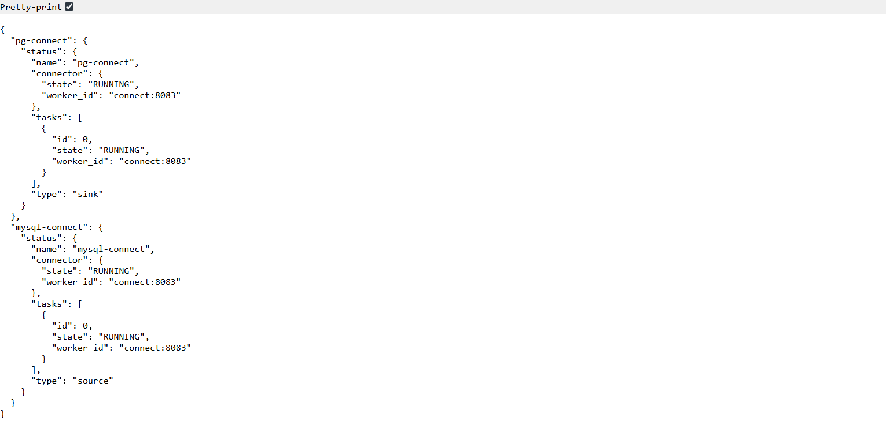

# Kafka-Data-Pipeline

A Change Data Capture (CDC) pipeline built using Apache Kafka and Kafka Connect to stream data in real-time from a **MySQL** database (`ecomm`) to a **PostgreSQL** database (`ecomm`) and the using  pipeline is set up with two connectors and uses plugin-based configuration to enable CDC via Kafka.

---

## 📌 Project Summary

- 🔄 **Source**: MySQL database named `ecomm`
- 🎯 **Sink**: PostgreSQL database named `ecomm`
- 🔌 **Connectors Used**:
  - **MySQL Source Connector** for capturing CDC events
  - **PostgreSQL Sink Connector** for writing to the destination
- 📦 **Plugins**: Uploaded to Kafka Connect for enabling connector functionality
- 📍 **Next Step**: Add support for **multiple sinks** (e.g., MongoDB, Elasticsearch) to fan out the data stream

---

## ⚙️ Technologies Used

- Apache Kafka
- Kafka Connect
- MySQL
- PostgreSQL
- Docker & Docker Compose

---

## 🚀 How to Run

1. **Clone the repository and go to the working directory**  

   > 💡 *Make sure Docker Desktop or Docker Engine is running before continuing.*
   ```bash
   git clone https://github.com/your-username/Kafka-Data-Pipeline.git

   cd Kafka-Data-Pipeline/path/to/your-working-directory

   docker compose -f dc.yaml up -d

   docker ps
   ```
   
## 📋 Included Services

| Service | Port | Description | Access URL |
|---------|------|-------------|------------|
| **Kafka Broker**    | 9092        | Apache Kafka broker with KRaft mode              | `localhost:9092`            |
| **Schema Registry** | 8081        | Confluent Schema Registry                        | `http://localhost:8081`     |
| **Kafka Connect**   | 8083        | Kafka Connect for data integration               | `http://localhost:8083`     |
| **ksqlDB Server**   | 8088        | Stream processing with ksqlDB                    | `http://localhost:8088`     |
| **Kafka UI**        | 8090        | Web-based Kafka management interface             | `http://localhost:8090`     |
| **MySQL**           | 3306        | Source database for CDC (ecomm)                  | `localhost:3306`            |
| **PostgreSQL**      | 5432        | Sink database for CDC (ecomm)                    | `localhost:5432`            |
| **JMX Metrics**     | 1234, 1235  | Prometheus JMX metrics endpoints                 | -                           |
  
## 🔗 Connect to Databases via VS Code

You can connect to the MySQL and PostgreSQL containers using VS Code with a database extension like **Database Client** or **SQLTools**.

### 🐬 MySQL Connection (Port: 3305)

| Field     | Value     |
|-----------|-----------|
| Host      | 127.0.0.1 |
| Port      | 3305      |
| Username  | root      |
| Password  | root      |
| Database  | mydb      |

### 🐘 PostgreSQL Connection (Port: 5432)

| Field     | Value     |
|-----------|-----------|
| Host      | 127.0.0.1 |
| Port      | 5432      |
| Username  | admin     |
| Password  | password  |
| Database  | admin     |

## 🛠 Database Preparation

Create a new blank database named `ecomm` in both MySQL and PostgreSQL before running the pipeline:

- 🐬 **MySQL** (Port: 3305)
- 🐘 **PostgreSQL** (Port: 5432)

You can do this via CLI or any database GUI:

```sql
CREATE DATABASE ecomm;
```

## 🔌 Launch Kafka Connectors

After starting all services, run the following commands to deploy the **MySQL** and **PostgreSQL** connectors:

### 🐬 Register MySQL Connector

```bash
curl -sS -X POST \
  -H "Accept: application/json" \
  -H "Content-Type: application/json" \
  http://localhost:8083/connectors \
  -d @connectors/mysql/mysql-connect.json
```

### 🐘 Register PostgreSQL Connector
```bash
curl -sS -X POST \
  -H "Accept: application/json" \
  -H "Content-Type: application/json" \
  http://localhost:8083/connectors \
  -d @connectors/pg/pg-connect.json
```

### ✅ Verify Connectors Are Running
Open the following URL in your browser to check the status of both connectors:
```bash
http://localhost:8083/connectors?expand=status
```
You should see both connectors listed with their status as "RUNNING"


## 🔄 CDC in Action

With the connectors successfully deployed, any DDL operations (like creating tables) or DML operations (like inserting, updating, or deleting records) in the MySQL `ecomm` database will be automatically reflected in the PostgreSQL `ecomm` database.

## 📄 Database Initialization Script

To set up the initial database schema and insert sample data into your MySQL `ecomm` database, use the provided SQL script: sql-scripts/mysql.sql


## ✅ Kafka Consumer Status

The Kafka consumer service is now fully functional and **listening to all topics** produced by the CDC pipeline.

This confirms that:

- All MySQL events are being streamed via Debezium
- Kafka topics are populated accordingly
- PostgreSQL sink receives updates in real-time
- Your consumer is subscribed and processing the data as expected


## 🎯 End-to-End Pipeline Verification

The data is now flowing successfully from the MySQL source database to the PostgreSQL target database.


### 🙏 Acknowledgements

Special thanks to **Eng. Karim Tawfik** for his support and guidance throughout this project 